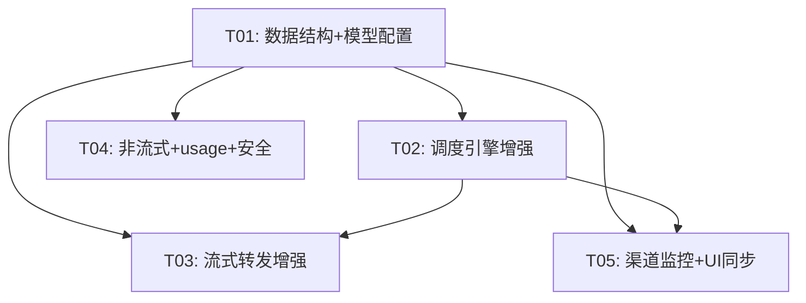

# API 代理增量架构设计 + 任务分解

> 基于 17 项已确认优化，对 `proxy_server.py` 做增量设计。不新建文件，仅修改现有 2 个文件。

---

## 一、增量设计要点

### 1.1 数据结构变更

| 类/结构 | 新增字段 | 类型 | 用途 | 关联优化项 |
|---------|---------|------|------|-----------|
| `UpstreamKey` | `model_cooldowns` | `dict[str, float]` | 模型级冷却时间戳 `{model: expire_ts}` | #10 |
| `UpstreamKey` | `cooldown_count` | `int` | 渐进退避计数器，成功后归零 | #10 |
| `UpstreamKey` | `last_health_check` | `float` | 上次健康检测时间戳 | #17 |
| `SubApiKey` | `key_mode=4` | `int` | 粘性会话模式（扩展现有枚举） | #7 |
| `ProxyRouter` | `_sticky_sessions` | `dict[str, tuple]` | `{session_hash: (key_id, expire_ts)}` TTL 1h | #7 |
| `ProxyRouter` | `_model_cooldowns` | `dict[str, dict]` | 内存缓存 `{key_id: {model: expire_ts}}` | #10 |
| `ProxyRouter` | `_health_check_thread` | `Thread` | 后台健康检测线程 | #17 |
| `MODEL_CONTEXT_LENGTHS["auto"]` | `128000 → 168000` | `int` | 与 dist 一致 | #1 |

### 1.2 新增方法清单

| 方法 | 所属类 | 职责 | 优化项 |
|------|--------|------|--------|
| `select_key_with_wait()` | ProxyRouter | 选不到 Key 时等待 5s 重试，超时返回 None | #3 |
| `_get_session_id()` | ProxyRouter | 从请求头/消息体提取或生成 session hash | #7 |
| `_is_key_schedulable_for_model()` | ProxyRouter | 检查 Key 对特定模型是否在冷却中 | #10 |
| `mark_model_cooldown()` | ProxyRouter | 按 model 标记冷却，渐进退避（10→20→40s） | #10 |
| `_classify_error()` | ProxyRouter | 错误分类：retryable_same / switch_key / fatal | #9 |
| `_send_keepalive()` | Handler | 发送 SSE 注释行 `: keep-alive\n\n` | #2 |
| `_detect_stream_error()` | Handler | 扫描 SSE chunk 检测 context_length_exceeded | #4 |
| `_drain_upstream()` | Handler | 客户端断开后继续读上游保 usage | #12 |
| `_health_check_loop()` | ProxyRouter | 定时（5min）对 active Key 发轻量请求 | #17 |

### 1.3 共享知识（跨函数约定）

- **错误分类协议**：`_classify_error()` 返回枚举 `RETRY_SAME`（502/503/超时→同Key重试1次）、`SWITCH_KEY`（401/403/429→直接换）、`FATAL`（400 context_too_long→终止不重试）
- **流式延迟首输协议**：`_forward_stream_response` 返回 `tuple[success: bool, error_type: str]`，`success=False` 时 `_handle_chat_completions` 可继续重试换 Key
- **模型冷却协议**：`model_cooldowns` 优先级高于 Key 级 `status`；select_key 先查模型冷却再查 Key 状态
- **session_id 提取优先级**：`X-Session-ID` 请求头 > messages 中 cache_control hash > messages 内容摘要
- **首字超时**：10s 无首 chunk → 视为失败可故障转移；空闲超时 60s → 主动关闭
- **keep-alive 间隔**：15s 发一次 SSE 注释行
- **响应体大小上限**：非流式 50MB，超限返回 502
- **健康检测**：5min 间隔 + 随机抖动 0-60s，发 `/v1/models` 轻量请求，失败标记 cooldown

---

## 二、有序任务列表

### T01: 数据结构 + 模型配置基础

| 属性 | 内容 |
|------|------|
| **优化项** | #1（auto 168K）、#13（context_window 字段） |
| **修改文件** | `proxy_server.py`：MODEL_CONTEXT_LENGTHS、UpstreamKey dataclass、SubApiKey dataclass、/v1/models 端点 |
| **依赖** | 无（基础层，所有后续任务依赖此） |
| **优先级** | P0 |
| **风险** | 低。纯数据变更，不影响逻辑流。proxy_db.json 自动兼容（新字段缺失时 dataclass 默认值兜底） |

**具体改动**：
- `MODEL_CONTEXT_LENGTHS["auto"]` 改 168000
- UpstreamKey 加 `model_cooldowns: dict`、`cooldown_count: int`、`last_health_check: float`
- /v1/models 响应中每个模型加 `context_window` 和 `max_context_window` 字段（值同 maxInputTokens）

---

### T02: 调度引擎增强

| 属性 | 内容 |
|------|------|
| **优化项** | #3（等待队列）、#7（粘性会话）、#8（负载感知）、#9（故障转移分类）、#10（模型级冷却+退避）、#11（Retry-After） |
| **修改文件** | `proxy_server.py`：ProxyRouter.select_key、mark_key_cooldown、_handle_chat_completions 重试循环、新增 _classify_error / _get_session_id / mark_model_cooldown / _is_key_schedulable_for_model / select_key_with_wait |
| **依赖** | T01 |
| **优先级** | P0 |
| **风险** | **高**。重试循环是核心路径，改动最大。需确保：1) 粘性会话 hash 冲突不导致死锁；2) 等待队列不阻塞主线程；3) 渐进退避计数器线程安全 |

**具体改动**：
- select_key 增加 key_mode=4 分支（粘性会话），在 key_mode=1/2/3 分支前加并发计数排序（负载感知）
- select_key 返回前调用 `_is_key_schedulable_for_model()` 过滤模型级冷却
- _handle_chat_completions 中 `select_key` 调用改为 `select_key_with_wait`（等待 5s）
- 重试循环中用 `_classify_error()` 替代现有 if-elif 错误处理链
- mark_key_cooldown 改为 mark_model_cooldown（保留旧方法兼容）
- 429 响应头加 `Retry-After`（取冷却时间或 Retry-After 上游值）

---

### T03: 流式转发增强

| 属性 | 内容 |
|------|------|
| **优化项** | #2（首字节超时+心跳）、#4（SSE错误检测）、#6（延迟首输+故障转移）、#12（断开后drain）、#16（首字时间） |
| **修改文件** | `proxy_server.py`：_forward_stream_response、_handle_chat_completions 调用方式、新增 _send_keepalive / _detect_stream_error / _drain_upstream |
| **依赖** | T01（数据结构）、T02（故障转移分类协议） |
| **优先级** | P0 |
| **风险** | **高**。延迟首输改变核心流式路径——需在写响应头前缓冲首行，检测异常后 return 信号给重试循环。若缓冲逻辑有 bug，可能导致流式响应损坏 |

**具体改动**：
- _forward_stream_response 返回值改为 `tuple[bool, str]`（成功标志+错误类型）
- 流式分支：拿到 200 后不立即 send_response，先读首 chunk（10s 超时），检测异常后决定是否写头
- iter_content 循环中加 keep-alive 定时器（15s 间隔发注释行）
- 每个 chunk 调用 _detect_stream_error 扫描 `context_length_exceeded`
- BrokenPipeError 改为 continue（不 sendall 但继续读），调用 _drain_upstream
- 记录首字时间到日志

---

### T04: 非流式响应 + usage + 安全

| 属性 | 内容 |
|------|------|
| **优化项** | #5（响应体大小限制）、#14（原样透传）、#15（cached_tokens） |
| **修改文件** | `proxy_server.py`：_forward_stream_response 非流式分支、_update_stats |
| **依赖** | T01 |
| **优先级** | P1 |
| **风险** | 中。#14 原样透传需改变现有 SSE→JSON 拼装逻辑，可能影响 WorkBuddy 对 reasoning_content 的解析 |

**具体改动**：
- 非流式分支：Content-Length > 50MB 时返回 502
- 非流式拼装：改为收集完整 SSE 后取最后一个含完整 choices+usage 的 chunk 原样返回（保留 id/model/choices/usage，不重组 content）
- _update_stats 中 cached_tokens 提取补 `prompt_cache_hit_tokens` / `cached_tokens` 双路径

---

### T05: 渠道监控 + UI 同步

| 属性 | 内容 |
|------|------|
| **优化项** | #17（渠道监控） |
| **修改文件** | `proxy_server.py`（ProxyRouter 新增 _health_check_loop）、`api_proxy.py`（key_mode=4 下拉项 + 冷却状态展示） |
| **依赖** | T01、T02 |
| **优先级** | P2 |
| **风险** | 低。健康检测在独立线程，不影响主路径。UI 改动仅加一个下拉选项 |

**具体改动**：
- ProxyRouter.start() 中启动 _health_check_thread（daemon，5min + 随机抖动）
- 健康检测：对每个 active Key 发 GET /v1/models，失败标记 cooldown
- api_proxy.py：_mode_combo 加第 4 项「4-会话亲和」，mode_map 加 key_mode=4 映射

---

## 三、任务依赖图

**实现顺序建议**：T01 → T02 → T03 → T04 → T05（T04 可与 T03 并行）

---

## 四、风险评估

### 4.1 WorkBuddy 兼容性影响

| 优化项 | 风险 | 缓解 |
|--------|------|------|
| #6 延迟首输 | 首字延迟增加 ~100ms（缓冲首行） | WorkBuddy 超时阈值宽裕，影响可忽略 |
| #14 原样透传 | 改变非流式响应结构，WorkBuddy 可能依赖重组后的字段顺序 | 保留 choices[0].message.content 结构不变，仅不丢额外字段 |
| #11 Retry-After | WorkBuddy 可能不理解此头 | 标准头，不理解的客户端忽略即可 |
| #1 auto 168K | WorkBuddy 压缩阈值变化 | 168K 比 128K 更宽松，压缩触发更晚，不会破坏 |

### 4.2 需要同步改 api_proxy.py

| 优化项 | UI 改动 |
|--------|---------|
| #7 粘性会话 | _mode_combo 加「4-会话亲和」选项 + tooltip |
| #10 模型级冷却 | Key 状态展示可显示模型级冷却（可选，优先级低） |
| #17 渠道监控 | 可选加「上次检测时间」列（优先级低） |

### 4.3 数据迁移

| 优化项 | 迁移需求 |
|--------|---------|
| #10 model_cooldowns | **无需迁移**。新字段缺失时 dataclass 默认值 `{}` 兜底，旧 proxy_db.json 自动兼容 |
| #1 auto 168K | **无需迁移**。代码内硬编码常量，不涉及 DB |
| 所有 UpstreamKey 新字段 | **无需迁移**。dataclass 默认值兜底 |

---

## 五、待明确事项

1. **粘性会话 session_id 来源**：WorkBuddy 是否发送 `X-Session-ID` 头？若不发，则 fallback 到 messages hash——但多轮对话中 messages 会增长导致 hash 变化，粘性失效。**建议**：用 system prompt + 首条 user message 的 hash 作为会话标识（相对稳定），或要求用户在 WorkBuddy 侧配置 session 头。

2. **等待队列超时时间**：建议 5s，但高峰期可能不够。是否需要可配置？当前建议硬编码 5s，后续按需调整。

3. **非流式原样透传边界**：上游强制流式，我们拼装成 JSON。#14「原样透传」是指取最后一个完整 chunk 的 JSON 结构？还是保留所有 SSE 事件字段？**建议**：取最后一个含 usage 的 chunk，补全 choices[0].message.content（从 delta 拼接），其余字段原样保留。

4. **健康检测请求模型**：用 `/v1/models` GET（不消耗积分）还是发一个最小 chat 请求？**建议**：用 /v1/models，零成本。

5. **渐进退避上限**：10→20→40→80s 是否需要上限？**建议**：封顶 80s，第 4 次后保持 80s 不再递增。
